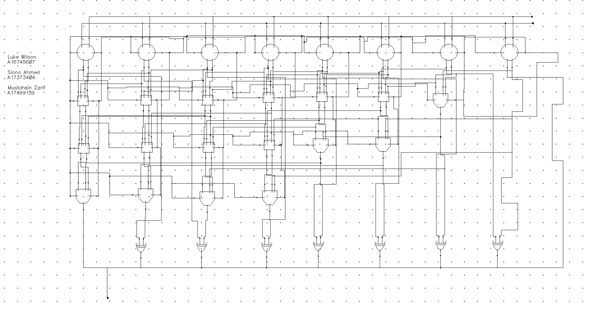

## Project Overview

This project involved the design and simulation of a custom **8-bit Kogge-Stone adder** as part of the ECE 165: Digital Integrated Circuit Design course at UC San Diego. The primary challenge was to optimize speed while maintaining reasonable power levels.

### Architecture & Design

The Kogge-Stone architecture was selected because its tree-based structure allows for carry-look-ahead benefits without the high fan-in issues of large-bit adders.

* **Logic Style:** Transitioned from dynamic logic to **static logic** to resolve weak drive strengths and clock synchronization issues.
* **Performance:** Achieved a maximum clock frequency of **3.1 GHz** at a **1.1 V** power supply.
* **Optimization:** Used minimal transistor sizing to reduce parasitic capacitance and propagation delay.

---

## Schematic Designs

### 0. AND and OR Gates

Before designing the adder, we created AND and OR gates with matched pull-up and pull-down strengths and used them to construct the group-G block.

*Figure 0: Schematic of the group-G block and matched AND/OR gates.*

---

### 1. PG Block

The first stage of the architecture translates input bit pairs into **Propagate (P)** and **Generate (G)** signals.

*Figure 1: Schematic of the PG block used for initial bit translation.*

---

### 2. Full 8-bit Adder Hierarchy

Three hierarchical logic layers are used to efficiently compute all group-PG values for the 8-bit architecture.

*Figure 2: Complete schematic of the static 8-bit Kogge-Stone adder.*

---

## Performance Benchmarking

The Kogge-Stone architecture outperformed the baseline Ripple-Carry Adder (RCA) by **800 MHz**.

| Parameter | Kogge-Stone Design | Ripple-Carry (Baseline) |
| :--- | :--- | :--- |
| **Max Frequency (fmax)** | 3.1 GHz | 2.3 GHz |
| **Power @ 1.1 V** | 451.8 µW | 318.42 µW |
| **Energy per Operation** | 1.457 × 10⁻¹³ J | 1.39 × 10⁻¹³ J |
| **Critical Path Input** | A = 00000001, B = 01111111 | A = 00000001, B = 11111111 |

---

## Simulation Results

Validation was performed using transient waveform simulations across more than 10 input transitions to verify correct timing behavior at the critical path.

*Figure 3: Maximum-frequency transient simulation results at the critical path.*

---

**Team Members:** Luke Wilson, Siona Ahmed, and Mustahsin Zarif
